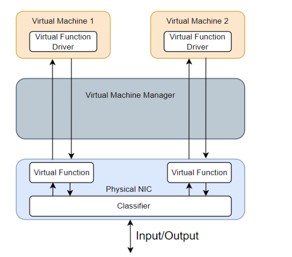
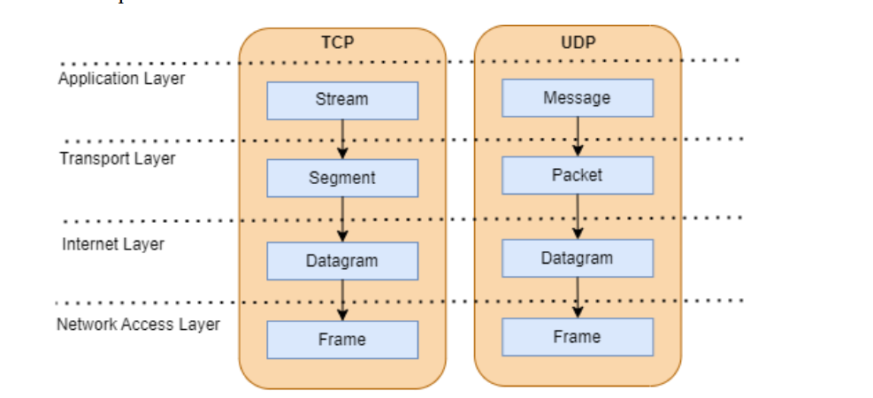
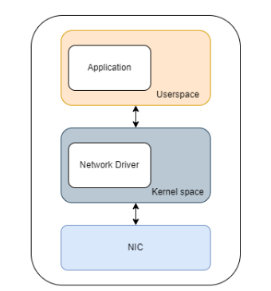
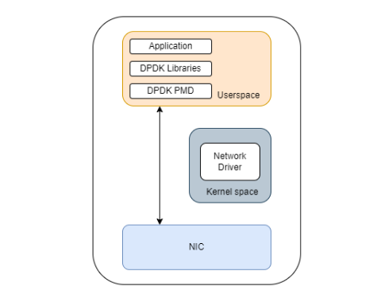
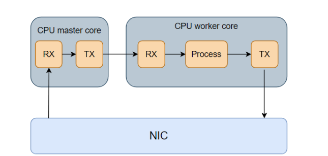

# DPDK & SR-IOV

## What is DPDK?

Data Plane Development Kit (DPDK) is a set of libraries and drivers that facilitate the development of high-performance packet processing applications. 

DPDK (Data Plane Development Kit) was developed by Intel to accelerate packet processing and was released to the public in the year 2010. It accelerates network I/O by
allowing data packets to transition to the user space directly without having to go through kernel space, thus avoiding overheads such as memory copying and context switching.

## What is SR-IOV?

SR-IOV, an acronym for Single Root I/O Virtualization, serves the purpose of partitioning a singular physical function, such as a *Network Interface Card (NIC)*, into *multiple virtual functions*. 

- These virtual functions act as independent network interfaces accessible through application
- The concept behind SR-IOV involves creating virtual functions that mimic direct access to the NIC, offering accelerated Input/Output (IO) by bypassing both the Virtual Machine Manager and the Virtual Switch
- SR-IOV exhibits speed advantages by circumventing certain NIC functions. 
- It demonstrates efficient scalability without excessive resource consumption, making it a preferred choice for high-performance virtual computing environments. 

## Packet processing 

- Packet processing in Linux involves the handling and manipulation of network packets as they traverse the networking stack.
- The Linux kernel is responsible for managing the reception, transmission, and routing of packets.
- The Linux networking stack is a layered architecture that handles various networking tasks.

- Key layers include the Data Link Layer, Network Layer, Transport Layer, and Application Layer.

### Traditional Kernel-Based Stack

Packets traverse a multi-layered stack within the kernel, 
involving tasks like buffering, demultiplexing, protocol processing, and socket-based delivery to applications.
There are two primary methods for Network Interface Card (NIC) communication with the kernel: interrupts and polling. Both techniques can be employed independently, or a combination of both may be utilized.

*Interrupt-Driven I/O*
- Currently, interrupt-driven I/O is the more prevalent technique.
- Commonly used for its efficiency in handling I/O operations, particularly in standard scenarios.

*Polling for High-Throughput I/O*

- Polling is more frequently applied in situations demanding high-throughput I/O.
- Device drivers may be configured to switch to polling when the I/O rate is high, reverting to interrupts when the I/O rate decreases.

*Flexible Configuration*

- The choice between interrupts and polling, or a combination, provides flexibility based on specific I/O requirements.
- Allows optimization for varying scenarios, adjusting to the characteristics of the workload or I/O rate.

#### SK_BUFF

SK_BUFF (Socket Buffer) is a fundamental data structure in the Linux kernel that represents network packets. It plays a crucial role in packet processing, buffering, and transmission across various network layers.

*Key characteristics*
 - Packet Metadata and Data:
    - Stores packet data itself, along with essential metadata:
     - Length
     - Checksum status
     - Protocol type
     - Timestamps
     - Network device information
     - Routing information
     - Quality of Service (QoS) tags
     - More
- Doubly Linked List Organization:
     - SK_BUFFs form doubly linked lists, enabling efficient movement between queues and processing modules within the kernel.
- Buffer Management:
    - Manages packet data buffers flexibly, using techniques like:
    - Linear buffers for small packets
    - Fragmented buffers for large packets
    - Zero-copy mechanisms to minimize data movement
- Function Pointers:
    - Includes function pointers for custom packet processing actions, allowing for protocol-specific handling and flexibility.

- Key uses within the kernel:
  - Network Device Drivers receive and transmit packets using SK_BUFFs.
  - Network Stack Layers Process and forward packets through layers like IP, TCP, and UDP.
  - Routing - Determine packet paths and forward them accordingly.
  - Traffic Control - Implement QoS features and traffic shaping.
  - Firewalls and Security Modules - Inspect and filter packets for security purposes.

### Differences between Packet processing techniques

| Feature                               | Traditional Kernel-Based Processing                           | Kernel Bypass Processing                                   |
|---------------------------------------|-----------------------------------------------------------------|------------------------------------------------------------|
| **Execution Location**                | In the kernel space, involving the operating system's networking stack | In user space, bypassing the kernel for direct hardware access |
| **Packet Reception**                  | Interrupt-driven, involving kernel handling and context switches | Polling or event-driven, reducing reliance on interrupts     |
| **Packet Transmission**               | Relying on kernel for transmission, involving context switches  | Direct user-space control over NICs, minimal kernel involvement |
| **Memory Access**                     | Utilizes kernel-managed memory, may involve additional overhead | Manages its own memory pools in user space for optimized access |
| **Latency**                           | Generally higher latency due to kernel involvement               | Lower latency, especially in scenarios requiring rapid packet processing |
| **Scalability**                       | Limited scalability, particularly in high-throughput scenarios  | Improved scalability, leveraging user space and parallel processing |
| **Context Switching**                 | Frequent context switches between user and kernel space           | Reduced context switching, enhancing efficiency and performance |
| **Ease of Customization**             | Limited customization due to reliance on kernel networking stack  | More flexibility for customization and optimization in user space |
| **Compatibility with Hardware**       | Adaptable to various hardware configurations                      | May require hardware-specific optimizations for full efficiency |
| **Use Cases**                        | General-purpose networking tasks, suitable for standard applications | High-performance scenarios like high-frequency trading, packet processing applications |
| **Examples of Technologies**          | TCP/IP stack in the kernel space                                   | Data Plane Development Kit (DPDK), Netmap, DPACC (Direct Packet Access) |

## DPDK

Within DPDK, there are Poll Mode Drivers (PMDs) for 1, 10, and 40 Gigabit, along with other options. 

PMDs serve as software components with APIs, enabling interaction with Network Interface Cards (NICs) and their queues directly from user space. By utilizing PMDs, DPDK applications gain the capability to access RX and TX descriptors without relying on interrupts, eliminating the necessity for the kernel to manage network traffic.

 

### Components of DPDK

- Environment Abstraction Layer (EAL): The EAL provides a uniform and consistent interface for DPDK applications to interact with the underlying hardware and operating system. It abstracts the differences between various environments, allowing DPDK to run seamlessly across different platforms.

- Memory Pool Manager (rte_mempool): DPDK's MPM is responsible for managing memory pools efficiently. It allows applications to allocate and deallocate memory in a way that minimizes fragmentation and optimizes performance. Memory pools are crucial for DPDK applications to efficiently manage memory for packet buffers.

- Poll-Mode Drivers (PMDs): PMDs are essential components that enable DPDK applications to communicate directly with Network Interface Cards (NICs) in user space. PMDs provide APIs for interacting with the NICs and their queues without relying on the kernel for processing interrupts. They play a crucial role in achieving high-throughput and low-latency packet processing.

- Network Packet Buffer Management (rte_mbuf): DPDK includes a buffer management system that efficiently handles the allocation and management of packet buffers. It ensures that the application has fast and direct access to buffers for packet processing, optimizing memory usage and minimizing packet processing overhead.

- Ring Manager(rte_ring): The Ring Library is a part of DPDK that provides a lockless, multi-producer, multi-consumer ring buffer implementation. It is used for inter-core communication and synchronization in a multi-core environment. Rings are employed for passing packets and metadata between different cores without the need for locks.

- Packet Framework (Pktmbuf): DPDK's Packet Framework, also known as Pktmbuf, is a packet buffer management library. It provides an abstraction for packet buffers, making it easier for applications to work with and process packets. Pktmbuf includes features for efficient packet manipulation and metadata storage.

#### Other components & features

- Multi-Core Support: DPDK is designed to take advantage of multi-core architectures. It provides mechanisms for distributing packet processing tasks across multiple cores, allowing for parallelism and scalability. Multi-core support is crucial for achieving high-performance packet processing in modern, multi-core systems.

- Device-agnostic API: DPDK provides a device-agnostic API that abstracts the differences between various NICs. This allows DPDK applications to be portable across different hardware platforms without requiring significant modifications.

- Poll-Mode Event Notification Framework: The Poll-Mode Event Notification Framework in DPDK facilitates event-driven packet processing. It allows applications to receive notifications about specific events, such as the arrival of packets or changes in the status of queues, without relying on interrupts. This framework contributes to the efficiency and responsiveness of DPDK applications.

### Types of Packet processing 

DPDK applications for packet processing can be categorized into two different types: run-to-completion or pipeline model

#### Run-to-Completion mode 

In the Run-to-Completion mode, the entire packet processing or network-related tasks are handled by a single thread within the application. This thread is responsible for executing the tasks in a sequential order.
- Incoming packets are typically placed in a queue. The single-threaded application dequeues tasks from this queue and processes them one at a time.
- The thread processes each task sequentially, meaning that it completes one task before moving on to the next. This sequential execution ensures determinism in the order of task processing.
- Since all tasks are processed by a single thread, there is minimal context switching overhead. Context switching refers to the process of saving and restoring the state of a CPU, which can be resource-intensive.

####  Pipeline Model 
This model involves breaking down a complex operation or set of tasks into smaller, independent stages, each handled by a dedicated processing unit or thread.  
- The overall operation or task is divided into several stages, each representing a distinct step in the processing pipeline. These stages can include tasks like packet parsing, filtering, transformation, and transmission.
- Different stages of the pipeline operate concurrently, allowing for parallel processing of multiple tasks. This parallelism improves throughput and reduces the overall processing time.
- After completing a stage, a processing unit hands over the partially processed data or task to the next stage in the pipeline. This handover is often achieved through shared data structures or buffers.
- By utilizing parallelism, the pipeline model ensures more efficient use of available resources, including CPU cores. It maximizes the throughput by allowing multiple tasks to progress through the pipeline simultaneously.
- Communication between stages is often required for tasks like passing intermediate results or coordinating decisions. Shared data structures or inter-thread communication mechanisms facilitate this coordination.

### Differences

| Feature                         | Run-to-Completion Model              | Pipeline Model                        |
|---------------------------------|--------------------------------------|---------------------------------------|
| **Execution Model**             | Single-threaded, run-to-completion   | Multi-threaded, pipeline processing   |
| **Thread Utilization**           | Uses a single thread per core        | Uses multiple threads per core, each dedicated to a specific stage in the pipeline |
| **Task Execution Order**         | Sequential execution of tasks        | Parallel execution of tasks in stages |
| **Concurrency**                 | Limited concurrency                 | Higher concurrency, better parallelism |
| **Scalability**                 | Limited scalability with increasing core count | Improved scalability with better utilization of multi-core CPUs |
| **Synchronization**             | Minimal synchronization requirements | Requires synchronization between stages |
| **Complexity**                  | Simplicity in design and debugging   | More complex due to inter-stage communication and synchronization |
| **Latency**                     | Lower latency for individual tasks   | Potentially higher latency due to inter-stage communication |
| **Throughput**                  | May limit overall system throughput  | Potential for higher throughput, especially in scenarios with parallelizable tasks |
| **Use Cases**                   | Simple applications with limited parallelism | Complex packet processing applications with multiple stages of processing |
| **Example Application**         | Simple packet forwarding            | Deep packet inspection, network functions virtualization (NFV) |

## SR-IOV & DPDK 

SR-IOV (Single Root I/O Virtualization) and DPDK (Data Plane Development Kit) are often used together in implementing 5G network functions to achieve optimal performance and efficiency. Here are the key reasons for their joint utilization in 5G networks:

- High Performance and Throughput: SR-IOV allows the creation of multiple virtual functions for a single physical NIC, enabling direct and efficient communication between the virtual functions and the hardware. This reduces the overhead associated with traditional networking, leading to higher performance. DPDK provides a set of libraries and drivers optimized for fast packet processing in user space. It enables applications to interact directly with NICs using Poll-Mode Drivers (PMDs), thereby achieving high throughput and low latency.

- Efficient Resource Utilization: SR-IOV enables the creation of virtual NICs with dedicated resources, ensuring efficient utilization of hardware capabilities. Each virtual function has direct access to the NIC, avoiding unnecessary layers in the networking stack. DPDK's user-space packet processing minimizes resource overhead associated with kernel-based processing, allowing for efficient utilization of CPU cores and memory.

- Scalability: 5G networks demand scalability to handle a massive number of devices and the associated increase in network traffic. SR-IOV's ability to create multiple virtual functions and DPDK's support for multi-core architectures provide scalability to meet the demands of 5G networks.

- Low Latency: DPDK's direct access to NICs in user space and SR-IOV's reduction of overhead contribute to lower latency in packet processing. This is crucial in 5G networks, especially for applications that require real-time communication, such as ultra-reliable low-latency communication (URLLC).

- Network Function Virtualization (NFV): NFV is a key aspect of 5G networks, allowing network functions to be virtualized and run on standard hardware. SR-IOV and DPDK play significant roles in NFV by providing efficient ways to handle I/O operations and accelerate packet processing.

- Customization and Optimization: DPDK allows developers to have fine-grained control over packet processing, enabling customization and optimization based on the specific requirements of 5G network functions. SR-IOV's direct access to physical resources allows for customization of virtual functions, tailoring them to the needs of specific network functions in the 5G environment.

- Complementary Technologies: SR-IOV and DPDK are complementary technologies; SR-IOV optimizes I/O operations and resource allocation, while DPDK optimizes the data plane for packet processing. Their combined use addresses different aspects of networking, resulting in a comprehensive solution for 5G network functions.