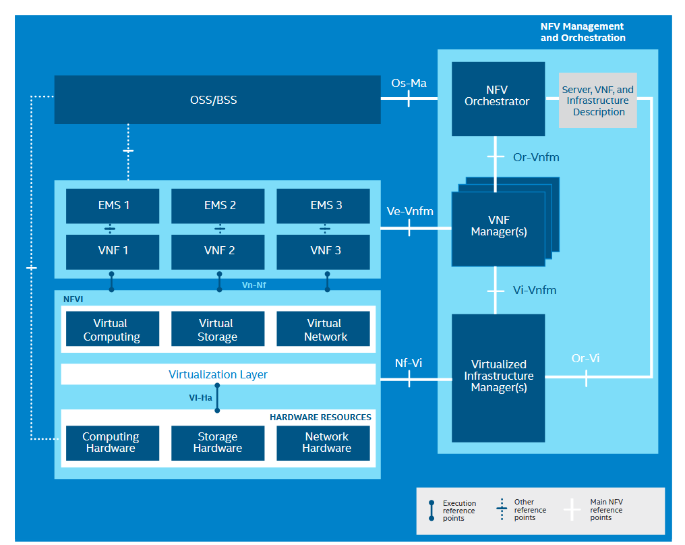

# Network function virtualization

Network Functions Virtualization (NFV) is a networking concept that aims to transform traditional network architectures by virtualizing network functions, typically implemented on dedicated hardware appliances. NFV leverages virtualization technologies to move these network functions from proprietary hardware to software-based solutions running on standard servers. By doing so, NFV offers greater flexibility, scalability, and efficiency in deploying and managing network services.

<!-- 

## ETSI NFV Releases overview
- Release 1 (2013-2014) - Initial set of foundational specifications.
    - Definition of NFV framework and architecture.
    - Identification of functional blocks and interfaces.
    - Introduction of the NFV Use Cases document.

- Release 2 (2014-2015): Expansion of Release 1 specifications and addressing additional use cases.
  - Further development of architectural specifications.
  - Addition of requirements for NFV management and orchestration (MANO).
  - Enhancements to interfaces and information models.
  - Introduction of the NFV Testing and Open Source activities.

- Release 3 (2015-2016): Refinement of existing specifications and incorporation of feedback.
  - Ongoing development of architectural framework.
  - Additional features in NFV MANO specifications.
  - Improvements to security aspects.
  - Continuation of testing and interoperability initiatives.

- Release 4 (2016-2017): Evolution of NFV specifications and increased emphasis on operational aspects.
  - Refinement of architectural principles.
  - Enhancements to MANO components.
  - Introduction of specifications related to Operations and Management.
  - Continued work on testing and validation activities.

- Release 5 (2017-2018): Continued development, addressing gaps, and enhancing specifications.
        Key Aspects:
  - Further improvements to NFV architecture.
  - Enhancements to security considerations.
  - Continued development of NFV MANO specifications.
  - Emphasis on supporting advanced use cases.

- Release 6 (2018-2019): Maturation of existing specifications and integration of 5G considerations.
    - Alignment with evolving 5G standards.
    - Refinement of NFV architecture and interfaces.
    - Enhancements to MANO specifications.
    - Addressing issues identified in previous releases. -->

## Terminology
Network virtualization involves abstracting network functions to be controlled and manipulated by software on standardized compute nodes.

Network Functions Virtualization (NFV) integrates cloud and virtualization technologies, facilitating the rapid development of scalable and automated network services.
 

## NFVi

NFV Infrastructure (NFVi) refers to the underlying hardware and software infrastructure that supports the deployment and execution of virtualized network functions. NFVi provides the necessary compute, storage, and networking resources to host virtualized network functions efficiently. It serves as the foundation for the virtualized network services enabled by NFV.

## NFVi Architecture

- Virtualization Layer: The virtualization layer consists of hypervisors or container runtimes that enable the creation and management of virtual machines or containers running network functions.

- Compute Resources: NFVi includes the compute resources, such as servers or virtual machines, where virtualized network functions are instantiated and executed.

- Storage Resources: Storage components in NFVi provide the necessary storage resources for storing virtual machine images, data, and configurations related to network functions.

- Networking Resources: NFVi encompasses networking components, including switches, routers, and virtual networks, to facilitate communication between virtualized network functions and external networks.

- Management and Orchestration (MANO): MANO components within NFVi handle the orchestration, management, and automation of the NFV infrastructure. This includes the Virtualized Infrastructure Manager (VIM) responsible for resource management.

